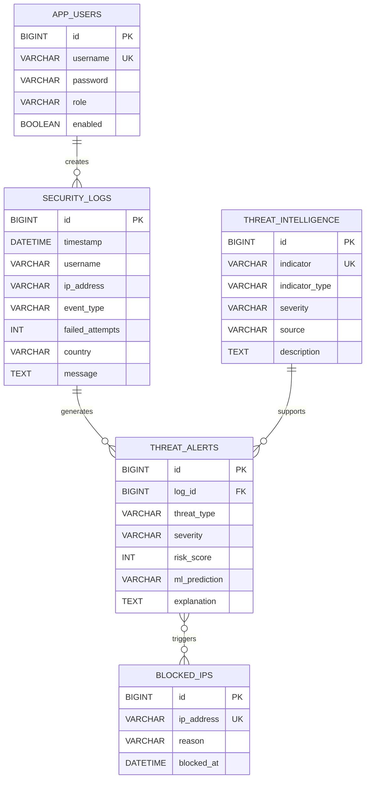

# ER Diagram

```mermaid
erDiagram
 APP_USERS ||--o{ SECURITY_LOGS : creates
 SECURITY_LOGS ||--o{ THREAT_ALERTS : generates
 THREAT_ALERTS }o--o{ BLOCKED_IPS : triggers
 THREAT_INTELLIGENCE ||--o{ THREAT_ALERTS : supports
 APP_USERS {
   BIGINT id PK
   VARCHAR username UK
   VARCHAR password
   VARCHAR role
   BOOLEAN enabled
 }
 SECURITY_LOGS {
   BIGINT id PK
   DATETIME timestamp
   VARCHAR username
   VARCHAR ip_address
   VARCHAR event_type
   INT failed_attempts
   VARCHAR country
   TEXT message
 }
 THREAT_ALERTS {
   BIGINT id PK
   BIGINT log_id FK
   VARCHAR threat_type
   VARCHAR severity
   INT risk_score
   VARCHAR ml_prediction
   TEXT explanation
 }
 THREAT_INTELLIGENCE {
   BIGINT id PK
   VARCHAR indicator UK
   VARCHAR indicator_type
   VARCHAR severity
   VARCHAR source
   TEXT description
 }
 BLOCKED_IPS {
   BIGINT id PK
   VARCHAR ip_address UK
   VARCHAR reason
   DATETIME blocked_at
 }
```
