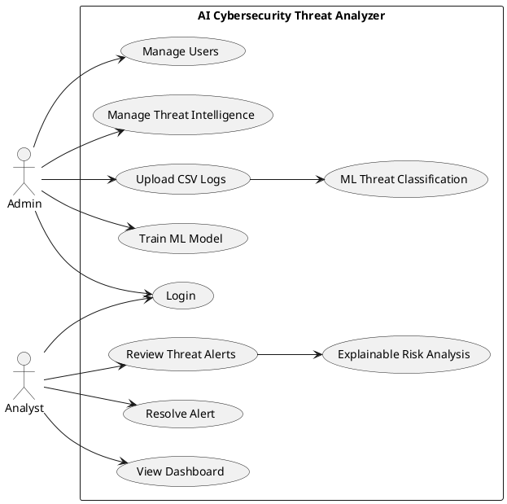
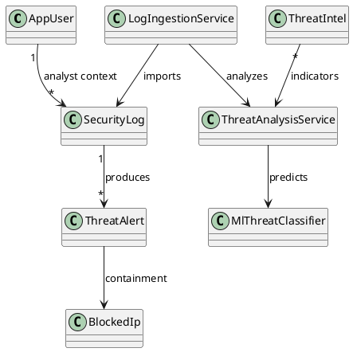
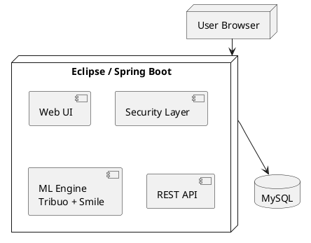

# UML diagrams

## Use Case Diagram

```plantuml
@startuml
left to right direction
actor Admin
actor Analyst
rectangle "AI Cybersecurity Threat Analyzer" {
 Admin --> (Login)
 Admin --> (Manage Users)
 Admin --> (Manage Threat Intelligence)
 Admin --> (Upload CSV Logs)
 Admin --> (Train ML Model)
 Analyst --> (Login)
 Analyst --> (View Dashboard)
 Analyst --> (Review Threat Alerts)
 Analyst --> (Resolve Alert)
 (Upload CSV Logs) --> (ML Threat Classification)
 (Review Threat Alerts) --> (Explainable Risk Analysis)
}
@enduml
```

## Class Diagram

```plantuml
@startuml
class AppUser
class SecurityLog
class ThreatAlert
class ThreatIntel
class BlockedIp
class ThreatAnalysisService
class MlThreatClassifier
class LogIngestionService

AppUser "1" --> "*" SecurityLog : analyst context
SecurityLog "1" --> "*" ThreatAlert : produces
ThreatIntel "*" --> ThreatAnalysisService : indicators
ThreatAnalysisService --> MlThreatClassifier : predicts
LogIngestionService --> SecurityLog : imports
LogIngestionService --> ThreatAnalysisService : analyzes
ThreatAlert --> BlockedIp : containment
@enduml
```

## Deployment Diagram

```plantuml
@startuml
node "User Browser" as browser
node "Eclipse / Spring Boot" as app {
 component "Web UI" 
 component "Security Layer"
 component "ML Engine\nTribuo + Smile"
 component "REST API"
}
database "MySQL" as db
browser --> app
app --> db
@enduml
```
